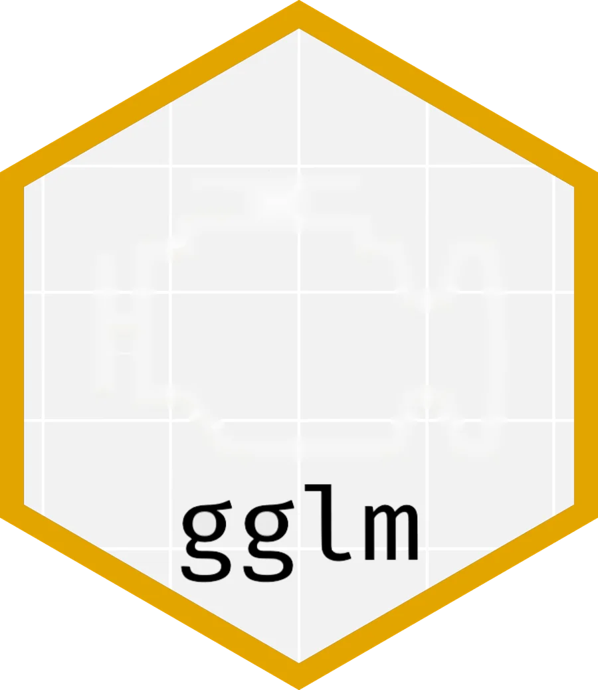
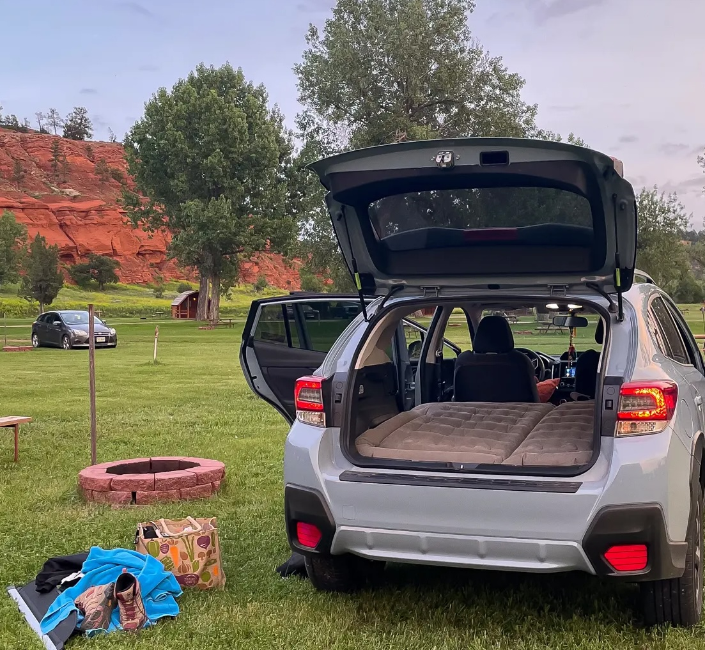
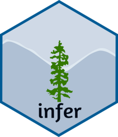
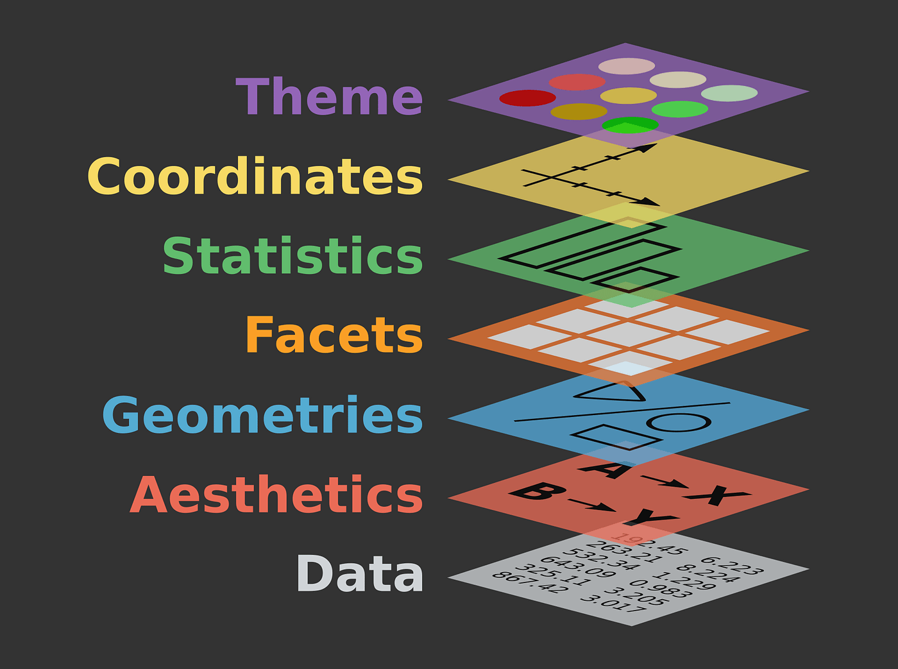
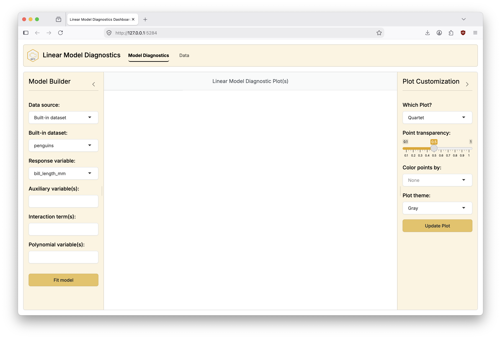
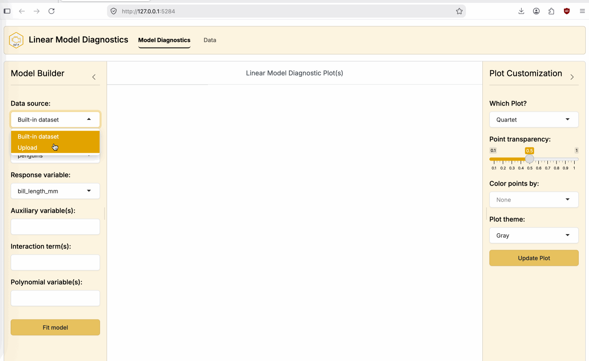
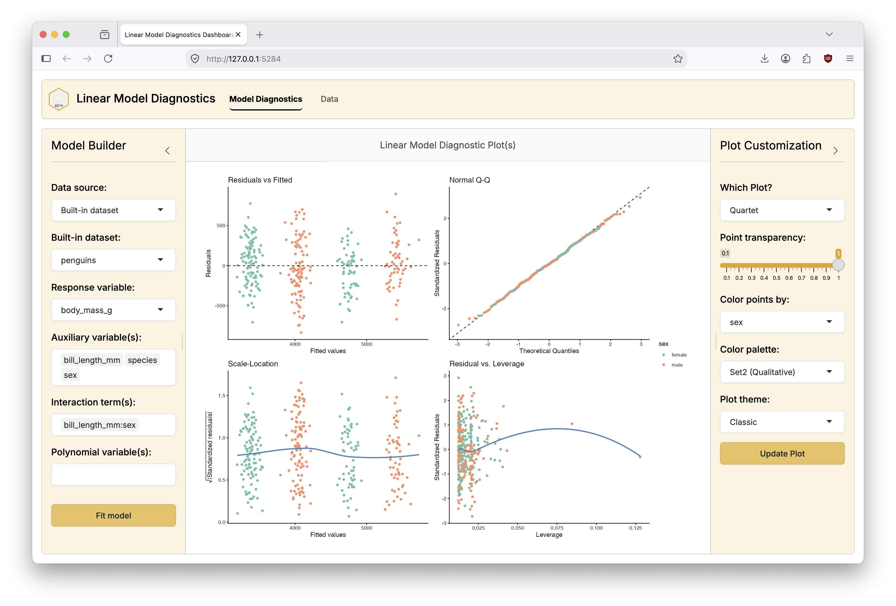

```{r}
#| include: false
#| warning: false
#| message: false

knitr::opts_chunk$set(echo = TRUE, warning = FALSE, message = FALSE,
                      fig.retina = 3, fig.align = 'center',
                      fig.asp = 0.75, fig.width = 8)
library(knitr)
library(tidyverse)
# 
# options(htmltools.preserve.raw = FALSE)
ggplot2::theme_update(text = ggplot2::element_text(size = 20))
```

::::: columns
::: {.column .center width="50%"}
{width="90%"}
:::

::: {.column .center width="50%"}
<br>

[`gglm`: A tool for teaching linear model diagnostics while adhering to the grammar of graphics]{.custom-title}

<br> <br>

[Grayson White]{.custom-subtitle}

[Joint Statistical Meetings 2026]{.custom-subtitle}

[Boston, MA \| August 6, 2026]{.custom-subtitle}


:::
:::::


------------------------------------------------------------------------


### Two ways of camping


:::: {.columns}

::: {.column width='50%' .center}

#### The camp(R)

{width='50%'}


**The camp(R)**: teaches R programming and statistics in their introductory statistics course.


:::

::: {.column width='50%' .fragment .center}

#### The camper

{width='74%'}

**The camper**: doesn't teach R programming in their introductory statistics course.


:::


::::


::: {.fragment .fade-up .midi .center} 

Both campers have **data-centric** classrooms!

:::

------------------------------------------------------------------------

### Why such different camps? 


:::: .columns

::: {.column width='45%'}

**Some possibilities**:

- Different goals? 
    - Statistical programming is taught elsewhere (e.g., introductory data science) at your institution.
    - Statistical programming isn't goal of your program / institution.

- Different student populations? 

- Something else?

:::

::: {.column width='10%'}

:::

::: {.column  width='45%'}

::: {.fragment}

**A common belief** (that I share):

:::

- Learning to code **and** to do statistics at the same time is **hard**! 

::: {.fragment .fade-up .midi .center}

**But, when done right, they can be highly symbiotic.**

:::

:::

::::


------------------------------------------------------------------------

### I am a camp(R)


::: {.fragment .fade-up .midi .center}

I believe that **learning to code** while learning statistics  

**helps students gain a deeper understanding** of the material.


:::

<br>

::: {.fragment}


:::: .columns

::: {.column width='25%'}

<br>

<br>

But nowadays, less people agree with me! (Video source: [Posit](https://posit.co/products/ai))

:::

::: {.column width='5%'}


:::

::: {.column  width='70%'}


:::

::::

:::


# What is the value of learning to code?

<br>

::: {.fade-up .midi .center .fragment}

When so many resources exist to help extract knowledge

from data without coding?

:::

<br>

::: {.fade-up .midi .center .fragment}

When an LLM can write (as good as) / (better) code than me? 

:::

------------------------------------------------------------------------

### Worst case: memorize symbols


:::: columns

::: {.column}

**Instructor**: here's my script to do _______. 

Swap out the data / columns your asked to investigate and run my code. Don't try to understand the code. 

:::


::: {.column}


:::


::::


------------------------------------------------------------------------


### Worst case: memorize symbols


:::: columns

::: {.column}

**Instructor**: here's my script to do **exploratory data analysis**.

Swap out the data / columns your asked to investigate and run my code. Don't try to understand the code. 


```{r}
#| eval: false
library(tidyverse)

# Six number summary
summary(mtcars)

# Boxplot - one categorical, one numeric variable
ggplot(mtcars, aes(x = as.factor(cyl), y = mpg)) + 
  geom_boxplot()

# Scatterplot - two numeric variables
ggplot(mtcars, aes(x = disp, y = mpg)) + 
  geom_point()

# Average by groups
mtcars %>%
  group_by(cyl) %>%
  summarize(avg_by_group = mean(mpg))
```


:::


::: {.column}


:::


::::


------------------------------------------------------------------------

### Worst case: memorize symbols


:::: columns

::: {.column}

**Instructor**: here's my script to do **a t-test**. 

Swap out the data / columns your asked to investigate and run my code. Don't try to understand the code. 

```{r}
#| eval: false
## Two-sample t-test
t.test(1:10, y = c(7:20))      # P = .00001855
t.test(1:10, y = c(7:20, 200)) # P = .1245    -- NOT significant anymore

## Traditional interface
with(mtcars, t.test(mpg[am == 0], mpg[am == 1]))

## Formula interface
t.test(mpg ~ am, data = mtcars)

## One-sample t-test
## Traditional interface
t.test(sleep$extra)

## Formula interface
t.test(extra ~ 1, data = sleep)

## Paired t-test
## The sleep data is actually paired, so could have been in wide format:
sleep2 <- reshape(sleep, direction = "wide",
                  idvar = "ID", timevar = "group")

## Traditional interface
t.test(sleep2$extra.1, sleep2$extra.2, paired = TRUE)

## Formula interface
t.test(Pair(extra.1, extra.2) ~ 1, data = sleep2)
```


:::


::: {.column}


:::


::::


------------------------------------------------------------------------

### Worst case: memorize symbols


:::: columns

::: {.column}

**Instructor**: here's my script to do **linear regression**.

Swap out the data / columns your asked to investigate and run my code. Don't try to understand the code. 

```{r}
#| eval: false
## Annette Dobson (1990) 
# "An Introduction to Generalized Linear Models".
## Page 9: Plant Weight Data.
ctl <- c(4.17, 5.58, 5.18, 6.11, 4.50, 
         4.61, 5.17, 4.53, 5.33, 5.14)
trt <- c(4.81, 4.17, 4.41, 3.59, 5.87,
         3.83, 6.03, 4.89, 4.32, 4.69)

group <- gl(2, 10, 20, labels = c("Ctl","Trt"))
weight <- c(ctl, trt)
lm.D9 <- lm(weight ~ group)

opar <- par(mfrow = c(2,2), oma = c(0, 0, 1.1, 0))
plot(lm.D9, las = 1)      # Residuals, Fitted, ...
par(opar)
```


:::


::: {.column}


* Providing code in this way to students does **not** facilitate learning. 

<br>

* We should be teaching **generalizable skills**, not **special cases**.

<br>

* There is little / no value in "learning to code" this way.


:::


::::


------------------------------------------------------------------------


### What should we do instead? 

<br>


::: {.midi .center .fade-up .fragment}

Provide students with the **tools to learn code** that have both a

design language and syntax that is **consistent** & **intuitive**. 

:::

<br> 

::: {.fragment}

Lots of great examples: 

:::

:::: .columns


::: {.column .fragment width='25%' .center}

:::

::: {.column .fragment width='75%' .center}
{width='70%'}
:::


::::


------------------------------------------------------------------------


### What should we do instead? 

<br>


::: {.midi .center}

Provide students with the **tools to learn code** that have both a

design language and syntax that is **consistent** & **intuitive**. 

:::

<br> 

::: {}

Lots of great examples: 

:::

:::: .columns


::: {.column width='25%' .center}

:::

::: {.column width='25%' .center}

:::

::: {.column .fragment width='25%' .center}

:::

::: {.column .fragment width='25%' .center}

:::


::::


------------------------------------------------------------------------


### `ggplot2` evokes a deeper understanding of graphics via the grammar


:::: columns

::: column

<br>

```{r}
#| echo: false
library(ggplot2)
library(palmerpenguins)
```


```{css echo=FALSE}
.big-code{
  font-size: 140%  
}
```

<div class=big-code>

```{r}
#| eval: false
ggplot(
  data = penguins,
  mapping = aes(x = bill_length_mm,
                y = body_mass_g)
  ) + 
  geom_point() + 
  geom_smooth(method = "lm") + 
  facet_wrap(~species, 
             scales = "free") + 
  theme_bw()
```
</div>


:::

::: column



:::

::::

<br>


::: {.fragment .fade-up .midi .center}

Once students have **learned the grammar**, they can **use `ggplot2`** to answer any statistical or data-scientific question they'd like! 

:::

------------------------------------------------------------------------


### `ggplot2` evokes a deeper understanding of graphics via the grammar


<br>

<div class=big-code>

```{r}
#| output-location: column
ggplot(
  data = penguins,
  mapping = aes(x = bill_length_mm,
                y = body_mass_g)
  ) + 
  geom_point() + 
  geom_smooth(method = "lm") + 
  facet_wrap(~species, 
             scales = "free") + 
  theme_bw()
```
</div>


::: {.fade-up .midi .center}

Once students have **learned the grammar**, they can **use `ggplot2`** to answer any statistical or data-scientific question they'd like! 

:::

------------------------------------------------------------------------


### `ggplot2` evokes a deeper understanding of graphics via the grammar


<br>

<div class=big-code>

```{r}
#| output-location: column
ggplot(
  data = penguins,
  mapping = aes(x = bill_length_mm,
                y = species)
  ) + 
  geom_boxplot() + 
  theme_bw()
```
</div>


::: {.fade-up .midi .center}

Once students have **learned the grammar**, they can **use `ggplot2`** to answer any statistical or data-scientific question they'd like! 

:::

------------------------------------------------------------------------


### `ggplot2` evokes a deeper understanding of graphics via the grammar


<br>

<div class=big-code>

```{r}
#| output-location: column
ggplot(
  data = penguins,
  mapping = aes(x = species,
                fill = sex)
  ) + 
  geom_bar() + 
  scale_fill_manual(
    values = c("goldenrod",
               "purple3")
  ) + 
  theme_classic()
```
</div>


::: {.fade-up .midi .center}

Once students have **learned the grammar**, they can **use `ggplot2`** to answer any statistical or data-scientific question they'd like! 

:::

------------------------------------------------------------------------


### Linear Regression

::: {.midi .center}


Suppose that you ask your students to fit a linear regression model to predict penguin bill length by their body mass and sex. 

:::

<br>

::: {.fragment}

<div class=big-code>


```{r}
library(palmerpenguins)
library(moderndive)
mod <- lm(bill_length_mm ~ body_mass_g + sex, penguins)
get_regression_table(mod)
```

</div>

:::

<br> 


::: {.fragment .fade-up .midi .center}

**What do you want your students to do as they fit and interpret this model? **

:::


------------------------------------------------------------------------

### Check if it is a sensible model!


<div class=big-code>

```{r}
#| output-location: column
penguins %>%
  drop_na(sex) %>%
  ggplot(aes(x = body_mass_g, 
             y = bill_length_mm, 
             color = sex)) + 
  geom_point() + 
  geom_parallel_slopes(se = FALSE)
```

</div>

- This is a great solution for models that can be visualized in 2D.

- But as soon as we'd like to assess more complex models, or just more formally check linear model assumptions, we need **diagnostic plots**. 


------------------------------------------------------------------------

### Diagnostic Plots 


------------------------------------------------------------------------

### Diagnostic Plots 


<div class=big-code>


```{r}
plot(mod, which = 1)
```

</div>


------------------------------------------------------------------------

### Diagnostic Plots 


<div class=big-code>

```{r}
plot(mod, which = 2)
```

</div>


------------------------------------------------------------------------


### Diagnostic Plots 


<div class=big-code>

```{r}
opar <- par(mfrow = c(2,2), oma = c(0, 0, 1.1, 0))
plot(mod, las = 1)
```

</div>


------------------------------------------------------------------------


### Worries


:::: columns

::: {.column width='45%'}


- That, if our students can't use our "universal" grammar of graphics to make basic diagnostic plots, that they won't believe this grammar is too helpful.

<br>

- That students might just start to memorize symbols, because we no longer are **consistent** or **intuitive** in our syntax.

:::

::: {.column width='10%'}
:::

::: {.column .fragment .nonincremental width='45%'}

- That maybe, just maybe, we should have been in the other camp. 


:::


::::

------------------------------------------------------------------------


### Solution: `gglm`


::: columns
::: {.column width="10%"}
```{r, echo = FALSE}

```
:::

::: {.column width="5%"}
:::

::: {.column width="85%"}

`gglm` provides diagnostic plots for linear models while adhering to the grammar of graphics through `stat_*()` layers that correspond to specific diagnostic plots. 

:::
:::


::: {.fragment}


<div class=big-code>


```{r}
#| output-location: column
library(gglm)
ggplot(mod) + 
  stat_fitted_resid()
```

</div>


:::

------------------------------------------------------------------------


### Solution: `gglm`

::: columns
::: {.column width="10%"}
```{r, echo = FALSE}

```
:::

::: {.column width="5%"}
:::

::: {.column width="85%"}

`gglm` provides diagnostic plots for linear models while adhering to the grammar of graphics through `stat_*()` layers that correspond to specific diagnostic plots. 

:::
:::


<div class=big-code>


```{r}
#| output-location: column
ggplot(mod) + 
  stat_normal_qq()
```

</div>

------------------------------------------------------------------------


### Solution: `gglm`

::: columns
::: {.column width="10%"}
```{r, echo = FALSE}

```
:::

::: {.column width="5%"}
:::

::: {.column width="85%"}

`gglm` provides diagnostic plots for linear models while adhering to the grammar of graphics through `stat_*()` layers that correspond to specific diagnostic plots. 

:::
:::


<div class=big-code>


```{r}
#| output-location: column
ggplot(mod) + 
  stat_scale_location()
```

</div>


------------------------------------------------------------------------


### Solution: `gglm`

::: columns
::: {.column width="10%"}
```{r, echo = FALSE}

```
:::

::: {.column width="5%"}
:::

::: {.column width="85%"}

`gglm` provides diagnostic plots for linear models while adhering to the grammar of graphics through `stat_*()` layers that correspond to specific diagnostic plots. 

:::
:::


<div class=big-code>


```{r}
#| output-location: column
ggplot(mod) + 
  stat_resid_leverage()
```

</div>


------------------------------------------------------------------------


### `gglm` has a slew of extra features

::: columns
::: {.column width="10%"}
```{r, echo = FALSE}

```
:::

::: {.column width="5%"}
:::

::: {.column width="85%"}

`gglm` lets you do anything you'd like to do with a regular `ggplot` object.

- For example, you can pass `aes()`thetics to create more informative diagnostic plots.


:::
:::


::: {.fragment}


<div class=big-code>


```{r}
#| output-location: column
ggplot(mod) + 
  stat_fitted_resid(aes(color = sex))
```

</div>

:::


------------------------------------------------------------------------


### `gglm` has a slew of extra features

::: columns
::: {.column width="10%"}
```{r, echo = FALSE}

```
:::

::: {.column width="5%"}
:::

::: {.column width="85%"}

`gglm` lets you do anything you'd like to do with a regular `ggplot` object.

- And of course you can customize to your `r emo::ji("heart")` 's content


:::
:::


::: {.fragment}


<div class=big-code>


```{r}
#| output-location: column
ggplot(mod) + 
  stat_fitted_resid(aes(color = sex)) + 
  facet_wrap(~sex) + 
  theme_bw()
```

</div>

:::


------------------------------------------------------------------------


### `gglm` allows for quick and easy diagnostics

::: columns
::: {.column width="10%"}
```{r, echo = FALSE}

```
:::

::: {.column width="5%"}
:::

::: {.column width="85%"}

- `gglm` provides a do-it-all function for the classic quartet of diagnostic plots,


:::
:::


::: {.fragment}


<div class=big-code>


```{r}
#| output-location: column
gglm(mod)
```

</div>

:::


------------------------------------------------------------------------


### `gglm` allows for quick and easy diagnostics

::: columns
::: {.column width="10%"}
```{r, echo = FALSE}

```
:::

::: {.column width="5%"}
:::

::: {.column width="85%"}

::: {.nonincremental}

- `gglm` provides a do-it-all function for the classic quartet of diagnostic plots,


- that you can even pass `aes()`thetics and additional arguments to!

:::


:::
:::


<div class=big-code>


```{r}
#| output-location: column
gglm(mod, 
     mapping = aes(color = sex), 
     shape = 10)
```

</div>


------------------------------------------------------------------------

### `gglm`: bells and whistles

::: columns
::: {.column width="10%"}
```{r, echo = FALSE}

```
:::

::: {.column width="5%"}
:::

::: {.column width="85%"}


- `gglm` produces diagnostic plots for any model compatible with `broom::augment()` or `broom.mixed::augment()`.

- Find available models with `gglm::list_model_classes()`.

- **Disclaimer**: deciding on the relevance of these diagnostic plots for any particular model form is up to the user.

:::
:::


::: {.fragment}


```{r}
#| output-location: column
library(lme4)
mixed_mod <- lmer(
  body_mass_g ~ bill_length_mm + sex + (1 | island),
  data = penguins
)

ggplot(mixed_mod) + 
  stat_fitted_resid(
    mapping = aes(color = island)
  ) + 
  theme(
    legend.position = "bottom"
  )
```


:::


# But what if you're a camper, not a camp(R)?

<br>


::: {.fragment .fade-up .midi .center}

`gglm` provides a `shiny` dashboard that displays interactive 

model diagnostics with `gglm::launch()`

:::


------------------------------------------------------------------------

### `gglm::launch()`


:::: columns

::: {.column width='10%'}
:::

::: {.column width='80%'}



:::

::: {.column width='10%'}
:::

::::

------------------------------------------------------------------------


### `gglm::launch()`: demo (built-in dataset)


:::: columns

::: {.column width='10%'}
:::

::: {.column width='80%'}


:::

::: {.column width='10%'}
:::

::::

------------------------------------------------------------------------


### `gglm::launch()`: demo (upload your own file)


:::: columns

::: {.column width='10%'}
:::

::: {.column width='80%'}



:::

::: {.column width='10%'}
:::

::::

------------------------------------------------------------------------

### `gglm::launch()`: details


:::: columns

::: {.column width='30%'}


<br>

<br>

- You can host your custom instance publicly / for your class with your own data via `gglm::launch()`.

:::

::: {.column width='10%'}
:::

::: {.column width='60%'}



:::

::::

- A basic instance is available online at [graysonwhite-gglm.share.connect.posit.cloud](graysonwhite-gglm.share.connect.posit.cloud/).


------------------------------------------------------------------------


### Conclusions


:::: columns

::: {.column width='45%'}


- As long as we facilitate students extracting knowledge from data, there is no wrong way to camp!

<br>

- If you're a camp(R), programming should be a **tool that enhances understanding**, not a barrier to extracting knowledge from data. 

<br>

- Consistent, principled, and intuitive syntax can help achieve the above goal. 


:::

::: {.column width='10%'}
:::

::: {.column width='45%'}

::: {.fragment .nonincremental}

- I'd love to chat and give you a `gglm` sticker!

<br>

{width='60%' fig-align='center'}

:::

:::

::::


# Thank you for listening!


<br>

<br>

::: {.center .nonincremental}

**Get in touch**:

- Email: [gwhite@reed.edu](mailto:gwhite@reed.edu)
- Web: [www.graysonwhite.com](https://graysonwhite.com/)

:::

