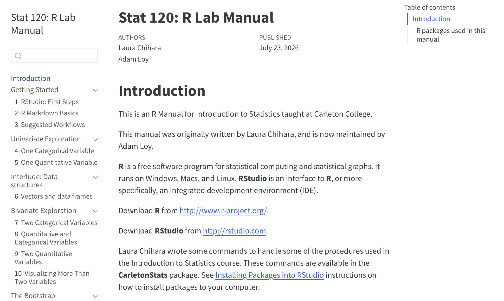
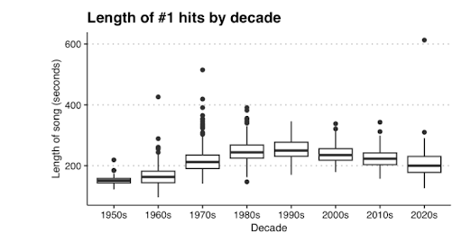
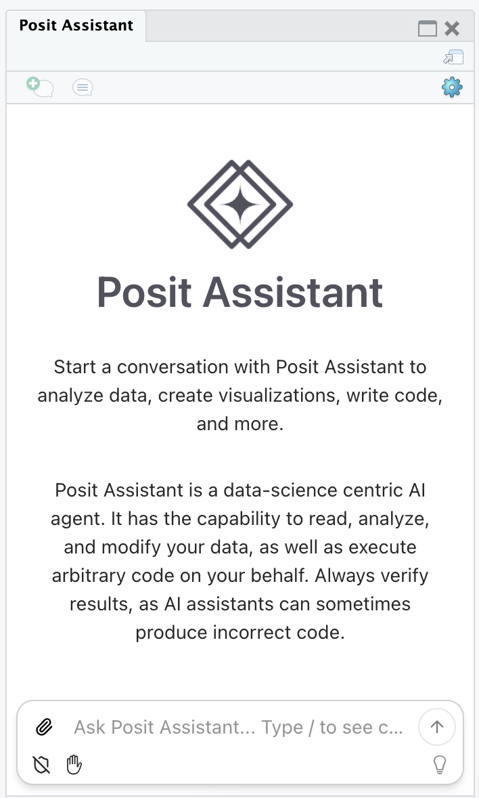
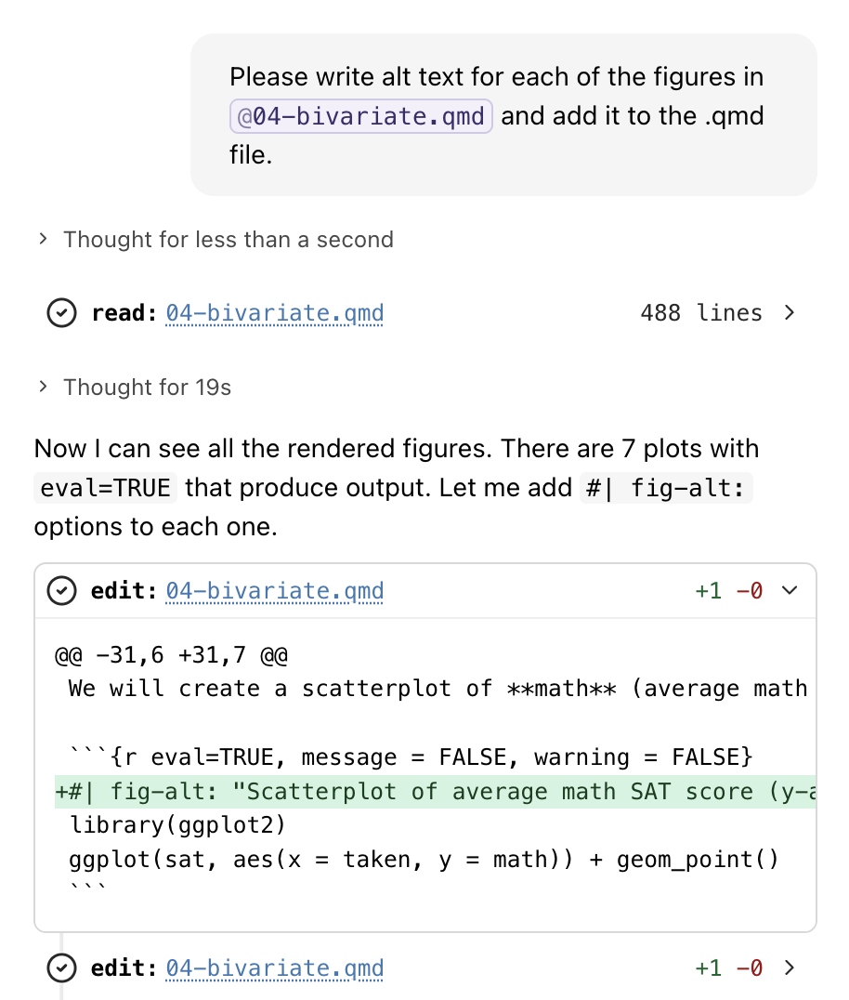

## About me

- Started teaching as the only statistician in a small math department
- Transitioned to a larger department, become one of four (now five) TT statisticians

## About Carleton

- Undergraduate liberal arts college

- 2000 students

- 20-25 statistics majors per year

- 10 sections of intro per year across 3 academic terms

- Intro often taught by visitors, sometimes by mathematicians

## Stat 1 at Carleton

- Taught out of Lock5

- R is used and supported throughout course

- Only intro on campus → diverse interests and backgrounds

- Meets 3x/week

## 

<!-- - Originally written by Laura Chihara -->
<!-- - Designed for in-class and out-of-class use -->
<!-- - Originally a PDF, now a quarto book -->

{.r-stretch}

## Rapid Overview of a Quarto Book

::: incremental
- Start with a **Quarto book project** in RStudio or Positron
- Separate `.qmd` files for each chapter + a landing page (`index.qmd`)
- `_quarto.yml` configures the book — edit it to add chapters
- Render just like any Quarto file
- Host on GitHub Pages, your campus website, etc.
:::

::: {.fragment .fade-up}
If you can write a Quarto document, you can build a book
:::

::: footer
Learn more: https://quarto.org/docs/books/
:::

## 

:::: {.columns}
::: {.column width="47.5%"}
### Benefits

- Adapted for our Stat 1
  - Visitors can quickly see what tools we use
  - Mathematicians can use it to learn R
- Can use it during class for activities, or for homework
- Can use GitHub to help track issues and requests from your department/team
- Only one person needs to maintain
:::

::: {.column width="5%"}
:::

::: {.column width="47.5%"}
### Challenges

- What happens if someone wants to use a different toolkit? <br> (e.g., ggformula vs. ggplot2)
- One person needs to agree to maintain it (during the summer)
:::
::::

## CarletonStats R package

- SBI intro taught with R can be overwhelming to students

- Laura Chihara developed {CarletonStats} in 2014 when Stat 1 shifted to SBI

- Implements simulation-based inference via `permTest*()` and `boot*()` commands

- Now, there are numerous other ways to reduce the cognitive load

  - Turn to apps (shiny, StatKey, etc.)
  - {mosaic}
  - {infer}

## Rapid Overview of an R Package

::: incremental
- An R package is just a **folder with a specific structure**
- Two ingredients: code + documentation
- R/RStudio tools (like `devtools`) know how to read that structure
:::

::: fragment
```         
mypackage/
├── DESCRIPTION          <- metadata: name, version, author, dependencies
├── NAMESPACE            <- what functions are exported to users
├── R/
│   ├── clean_data.R     <- your functions live here
│   └── plot_helper.R
├── man/
│   ├── clean_data.Rd    <- help files (auto-generated!)
│   └── plot_helper.Rd
├── data/
│   └── class_survey.rda <- optional: built-in datasets
└── vignettes/
    └── intro.Rmd        <- optional: long-form tutorials
```
:::

::: {.fragment .fade-up}
If you can organize files into folders and comment your code, you can build a package
:::

::: footer
Learn more: https://r-pkgs.org
:::

## Why consider an R package?

- You have a lot of custom R functions for a course

- You can learn a new skill that will help you teach your students!

- `remotes::install_github()` or `pak::pak()` are easier than loading scripts

- `install.packages()` is even easier, but required extra planning to get things on CRAN

## 

:::: {.columns}
::: {.column width="47.5%"}
### Benefits

- Adapted for our Stat 1, has the features we need to complement the rest of our toolkit
- Readily available on CRAN
- Only one person needs to maintain
:::

::: {.column width="5%"}
:::

::: {.column width="47.5%"}
### Challenges

- One person needs to agree to maintain it (during the summer)
:::
::::

# Potpourri

A few more life hacks that I found helpful this past year

## Generating alt text

- DOJ is mandating that all digital content, including password protected content, adheres to the WCAG 2.1 AA standards by April 2027 (it was 2026…)

- How can I quickly generate alt text for the lab manual, my websites, slides, etc.?!?

## Generating alt text

My idea: Use LLM to generate the alt text for my slides, notes, etc.

<br>



## Generating alt text

Prompt:

> Please create alt text for this set of box plots for the number of seconds songs in the top 100 of the billboard charts last (duration).

Result:

> This image features a series of vertical box-and-whisker plots titled "Length of #1 hits by decade," illustrating the duration of top-charting songs in seconds from the 1950s through the 2020s.

> The chart shows a clear historical trend where the median song length gradually increased from approximately 150 seconds in the 1950s to a peak of about 250 seconds in the 1990s, followed by a steady decline back toward 200 seconds in the 2020s. The 1970s and 1980s exhibit significant upward outliers, with some tracks reaching between 400 and 500 seconds, while the 2020s include an extreme outlier extending above 600 seconds. Overall, the 1950s have the most compact distribution with the shortest durations, while the 1990s show the highest consistent song lengths with the fewest outliers.

## Alt text for the lab manual

- In January, student worker wrote program to produce alt text for every image in the lab manual using Gemini

- That worked, but I don't have the program...

- Can Posit Assistant help me do the same thing?



## Alt text via Posit Assistant

Model: Claude Sonnet 4.6 (free trial)



## Alt text via Posit Assistant

> Scatterplot of average math SAT score (y-axis) against the percent of high school students who took the SAT (x-axis) for 51 U.S. states and D.C. The relationship is negative: states where a smaller share of students take the SAT tend to have higher average math scores.


```{r}
#| echo: false
#| out-width: 100%
#| fig-height: 3
#| fig-width: 5
#| fig-align: center
sat <-read.csv("http://math.carleton.edu/Stat120/RLabManual/sat.csv")

library(ggplot2)
ggplot(sat, aes(x = taken, y = math)) + geom_point() +
  ggthemes::theme_clean()
```


## Other "hacks" with LLMs

- Converting tex to typst

- Extracting information from PDFs (better OCR)

- Devising additional quiz questions for standards-based grading

- Simulating data to match examples in journal articles when you only have a table or plot

- Supercharged find and replace<br> (switch from `%>%` to `|>` in all resources for a course)

## Rapid Overview of Quarto Live

::: incremental
- Quarto Live is an extension that lets you embed **live, runnable R (or Python) code cells** directly into a Quarto reveal.js slide or webpage
- Powered by **WebR** — R runs entirely in the student's browser, no server or install required
- Students can edit code and see results **instantly**, right on the slide or page
:::

::: fragment
**The only syntax change: swap the chunk engine**

Regular R chunk:

```{{r}}
lm(rating ~ complaints, data = attitude)
```

Quarto Live R chunk:

```{{webr}}
lm(rating ~ complaints, data = attitude)
```
:::

::: {.fragment .fade-up}
If you can write a normal Quarto code chunk, you can make it interactive — just change `r` to `webr`.
:::

## Scaffolded example

> Fill in the blanks to fit an SLR model with rating as the response and complaints as the explanatory variable. Then print the model summary.


```{webr}
#| echo: true
# Press run!
fm <- ___(___ ~ ___, data = attitude)
___(fm)
```

