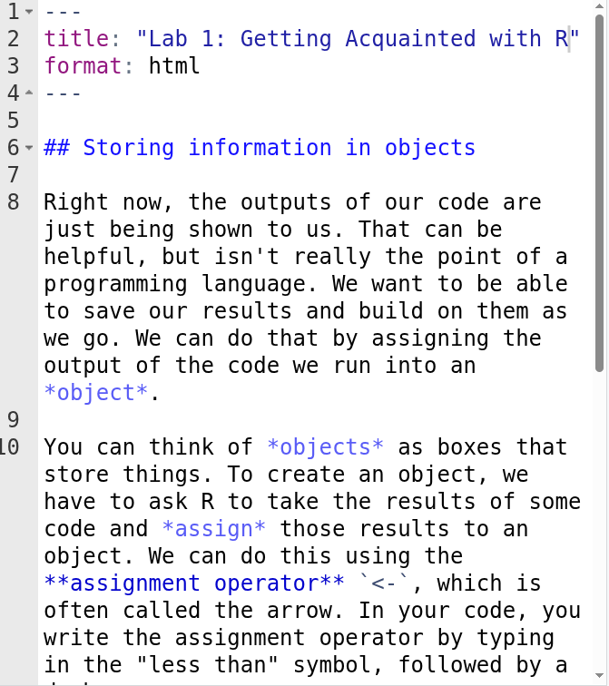
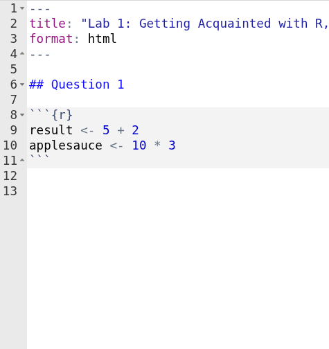
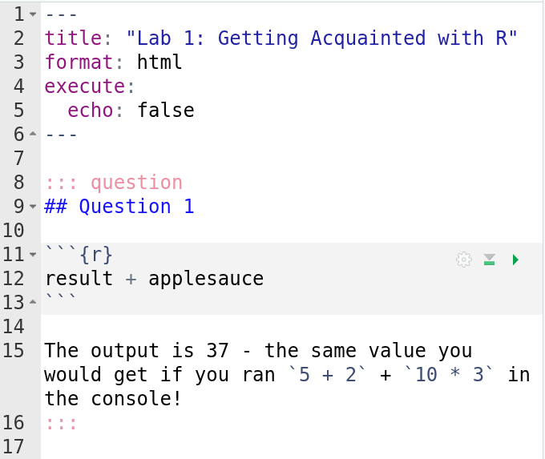
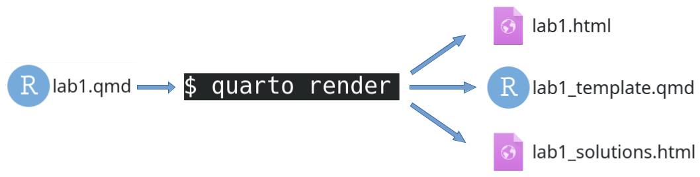
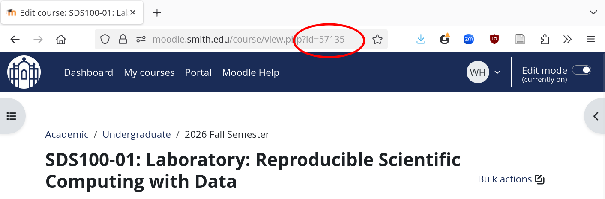
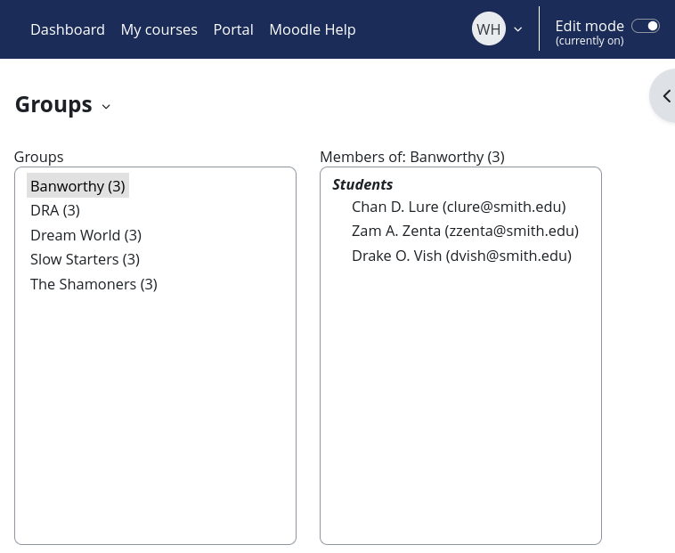
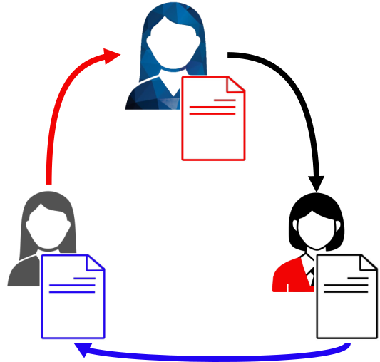
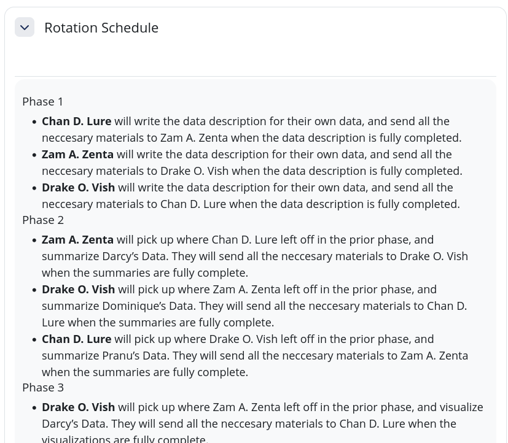

## A Typical In-Class Activity

:::: {.columns}

::: {.column width="33%" .fragment}

A "lab" with instructions

{fig-align="center"}
:::

::: {.column width="33%" .fragment}

A template with scaffolding

{fig-align="center"}
:::

::: {.column width="33%" .fragment}

A solutions guide

{fig-align="center"}
:::

::::

---

## The Hidden Pain of Good Assignments

Each of these is a separate document to create, distribute, and maintain

::: {.incremental}
- You changed the variables names in the lab
- Did you also change the template?
- And re-render the solutions?
:::

::: {.fragment}
We needed to solve this problem to scale [SDS 100: Reproducible Scientific Computing with Data](https://smithcollege-sds.github.io/) up for 100's of students and several simultaneous instructors (that change each semester!)
:::

---

## The Solution: The LTS Document Format

{fig-align="center"}

---

## What Does an LTS Document Look Like?

    ---
    title: "Lab 1: Getting Acquainted with R, RStudio and Quarto"
    editor: source
    format: lts-html:
    ---
    
    ## Creating Objects
    
    You can think of *objects* as boxes that store things. To create an object, we have to ask R to take the results of some code and *assign* those results to an object. We can do this using the **assignment operator** `<-`, which is often called the arrow. In your code, you write the assignment operator by typing in the "less than" symbol, followed by a dash.
    
    ::: question
    In your template file, locate the code chunk that looks like this:
    
    ```{{r}}
    #| echo: fenced
    result <- 5 + 2
    applesauce <- 10 * 3
    ```
    
    Write the command `result + applesauce` on the blank line at the end of the code chunk. Then click the green triangle "play" button in the upper right hand corner of the code chunk to execute the code in the chunk.
    :::
    
    ::: solution
    
    ```{{r}}
    result <- 5 + 2
    applesauce <- 10 * 3
    result + applesauce
    ```
    
    You should see the number 37 printed out in the console, just as it is shown above.
    :::

---

## How Does it Work?

::: {.incremental}
- Each `lts-html` document is parsed using a Quarto project pre-rendering script (written in Lua for portability)  
  - The `.question` divs are written into a new `*_template.qmd` file
  - The `.solution` divs are written into a new `*_solutions.qmd` file
- The lab, template, and solutions are rendered into HTML documents
  - A pandoc filter strips all `.solution` divs from the main lab file during rendering
:::

---

## Getting Started with LTS

#### To start a new project:

``` bash
quarto use template wjhopper/lts
```

::: {.fragment}
<br>

#### Within an existing project:

``` bash
quarto add wjhopper/lts
```
:::

::: {.fragment}
Then manually add

```yaml
pre-render: _extensions/wjhopper/lts/setup.lua
```

to the project's `_quarto.yml` configuration file
:::

---

## Meet the `moodleR` Package!

Let's upload these to our course's Moodle using the `moodleR` package!

```{r}
#| echo: true
# remotes::install_github("wjhopper/moodleR)
library(moodleR)
```

::: {.fragment}
`moodleR` speeds up common but repetitive and click-heavy tasks in Moodle by allowing you to script them from `r fontawesome::fa("r-project", fill = "steelblue")`
:::

::: {.fragment}
Built on top of the [`chromote`](https://rstudio.github.io/chromote/reference/index.html) and [`httr`](https://httr.r-lib.org/index.html) packages
:::

::: {.incremental}
- Moodle doesn't *really* have a full-fledged web API (and good luck getting your IT admin to turn it on for you anyway!)
- So `moodleR` conducts much of its business as though it were a web browser
:::

---

## Tell Me Who Are You?

:::: {.columns}

::: {.column}

First, open a browser for authentication

```{r}
#| eval: false
#| echo: true
tab <- moodleR::open_moodle(
  "https://moodle.smith.edu",
  graphical = TRUE
)
```

::: {.fragment}
After authentication, browser switches into "headless" mode
:::

:::

::: {.column}

:::

::::

---

## Uploading to Moodle

:::: {.columns}

::: {.column}
Navigate to the course, and create a new section

```{r}
#| eval: false
#| echo: true
tab$course <- 57135 # ID number from course page URL
section_info <- create_section(
  tab,
  section_name = "Lab 1"
)
```
:::

::: {.column}

:::

::::

::: {.fragment}
Add each file to the page using `moodleR::upload_file()`
```{r}
#| eval: false
#| echo: true
moodleR::upload_file(tab, section = "Lab 1", title = "Lab 1: Welcome to R", path = "lab1.html")
moodleR::upload_file(tab, section = "Lab 1", title = "Lab 1 Template", path = "lab1_template.qmd")
moodleR::upload_file(tab, section = "Lab 1", title = "Lab 1 Answer Key", path = "lab1_solutions.html",
                     visible = FALSE # Keep solutions hidden until after class
                     )
```
:::

---

## `MoodleR` Spotlight: Creating and Populating Groups

You have a group project coming up, and want teams to submit their work on Moodle

```{r}
#| echo: false
googlesheets4::gs4_deauth()
```

```{r}
#| cache: true
#| echo: true
groups <- googlesheets4::read_sheet("197hRqQ-Ul3w2IhTDb8iJd8ip6IK4BPB0PT9otJSLPLw")
print(groups)
```

---

## `MoodleR` Spotlight: Creating and Populating Groups

Normally, creating 5 new groups and populating them with 3 members each would require manual data entry for group and person, and several dozens of clicks

:::: {.columns}

::: {.column .fragment}

But with `moodleR`, it's two lines of code =)

```{r}
#| echo: true
#| eval: false

moodleR::create_groups(
  tab,
  groups = unique(groups$group_name)
  )
moodleR::populate_groups(tab, groups)
```

:::

::: {.column .fragment}

:::

::::

---

## `MoodleR` Spotlight: Project Rotation Schedules

In [SDS 100](https://smithcollege-sds.github.io/sds100/), we have a [phased group project](https://smithcollege-sds.github.io/sds100/final_project.html#gallery) where students collaborate on an exploratory data analysis

:::: {.columns}

::: {.column}

Each student chooses their own data set, and starts their own report

::: {.fragment fragment-index="1"}
Each week, they rotate data sets, and pick up the report where their group mate left off
:::

::: {.fragment fragment-index="4"}
We help students keep track of who's doing what each week by posting a **project rotation schedule**
:::

:::

::: {.column}

::: {.r-stack}

::: {.fragment .fragment .fade-out fragment-index="1"}
{fig-align="center}
:::


::: {.fragment .current-visible fragment-index="1"}
{fig-align="center}
:::

::: {.fragment fragment-index="3"}
{fig-align="center}
:::

:::

:::

::::

---

## `MoodleR` Spotlight: Project Rotation Schedules

:::: {.columns}

::: {.column}

#### Step 1: Create the Schedule

```{r}
#| eval: false
#| echo: true
schedule <- split(groups, groups$group_name) |>
  lapply(\(x) {
    sds100::create_rotation_table(
      group_members = x$name,
      row_names = paste("Phase", 1:4)
    ) |>
    sds100::write_rotation_schedule()
    }
  )
```

::: {.fragment}
`{ifingroup 63501}` is a Moodle [FilterCodes](https://marketplace.moodle.com/plugins/filter_filtercodes) that restricts visibility to members of a specific group
:::

:::

::: {.column .fragment fragment-index=0}

```
{ifingroup 63501}

<h5 id="phase-1">Phase 1</h5>
  <ul>
    <li><strong>Chan D. Lure</strong> will write the data description for their own data, and send all the neccesary materials to Zam A. Zenta when the data description is fully completed.</li>
    <li><strong>Zam A. Zenta</strong> will write the data description for their own data, and send all the neccesary materials to Drake O. Vish when the data description is fully completed.</li>
    <li><strong>Drake O. Vish</strong> will write the data description for their own data, and send all the neccesary materials to Chan D. Lure when the data description is fully completed.</li>
  </ul>
<h5 id="phase-2">Phase 2</h5>
  <ul>
    <li><strong>Zam A. Zenta</strong> will pick up where Chan D. Lure left off in the prior phase, and summarize Art’s Data. They will send all the neccesary materials to Drake O. Vish when the summaries are fully complete.</li>
    <li><strong>Drake O. Vish</strong> will pick up where Zam A. Zenta left off in the prior phase, and summarize Drag’s Data. They will send all the neccesary materials to Chan D. Lure when the summaries are fully complete.</li>
    <li><strong>Chan D. Lure</strong> will pick up where Drake O. Vish left off in the prior phase, and summarize Rose’s Data. They will send all the neccesary materials to Zam A. Zenta when the summaries are fully complete.</li>
  </ul>
<h5 id="phase-3">Phase 3</h5>
  <ul>
    <li><strong>Drake O. Vish</strong> will pick up where Zam A. Zenta left off in the prior phase, and visualize Art’s Data. They will send all the neccesary materials to Chan D. Lure when the visualizations are fully complete.</li>
    <li><strong>Chan D. Lure</strong> will pick up where Drake O. Vish left off in the prior phase, and visualize Drag’s Data. They will send all the neccesary materials to Zam A. Zenta when the visualizations are fully complete.</li>
    <li><strong>Zam A. Zenta</strong> will pick up where Chan D. Lure left off in the prior phase, and visualize Rose’s Data. They will send all the neccesary materials to Drake O. Vish when the visualizations are fully complete.</li>
  </ul>
<h5 id="phase-4">Phase 4</h5>
  <ul>
    <li><strong>Chan D. Lure</strong> will pick up where Drake O. Vish left off, and describe the ethical impacts of their own data.</li>
    <li><strong>Zam A. Zenta</strong> will pick up where Chan D. Lure left off, and describe the ethical impacts of their own data.</li>
    <li><strong>Drake O. Vish</strong> will pick up where Zam A. Zenta left off, and describe the ethical impacts of their own data.</li>
  </ul>
  
{\ifingroup 63501}
```
:::

::::


---

## `MoodleR` Spotlight: Project Rotation Schedules

:::: {.columns}

::: {.column}

#### Step 2: Post the Schedule

```{r}
#| eval: false
#| echo: true

moodleR::create_section(
  tab,
  section_name = "Rotation Schedule"
)

schedule |>
  paste(collapse = "\n") |>
  moodleR::add_text(section = "Rotation Schedule")
```

:::

::: {.column}

:::

::::

---

## `moodleR` Honorable Mentions

- `moodler::download_quiz_responses()`
  - Downloads quiz responses *and* file attachments in one batch (similar to how Moodle allows you to download all submissions for an assignment)
- `moodleR::get_course_roster()`
- `moodleR::export_gradebook()`
