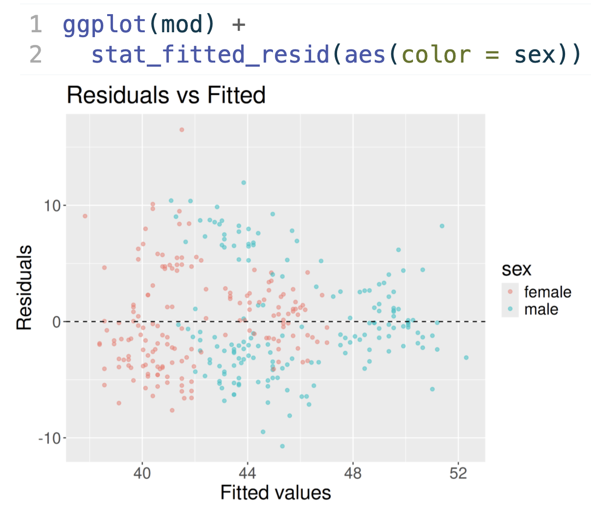
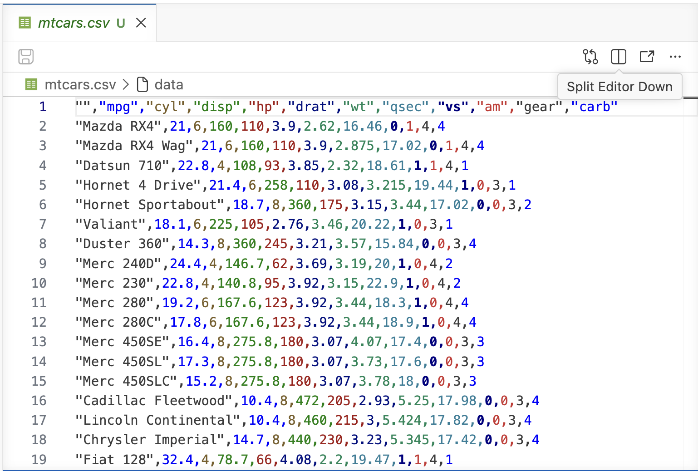
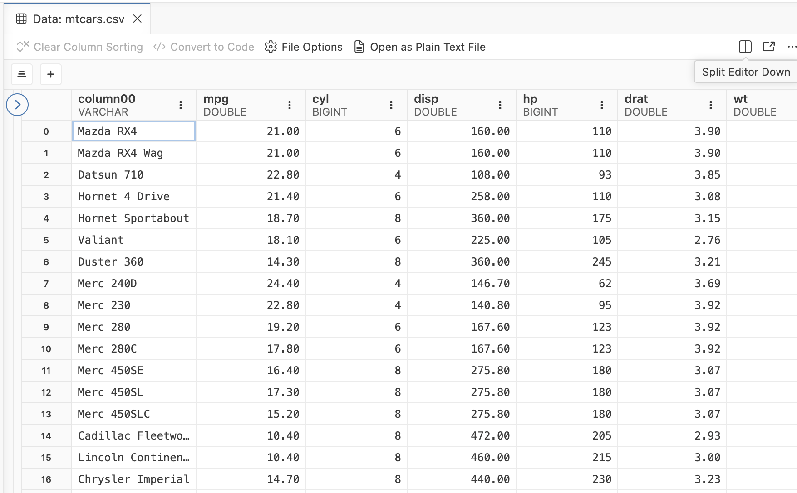

## `./session --recap` {.prompt}

<br>

::: {.center-align .hand-blue}
[beanumber.github.io/quarto-life-hacks-jsm26](https://beanumber.github.io/quarto-life-hacks-jsm26/)
:::

<br>

::: incremental
-   **Colin** :: automate all the things
-   **Grayson** :: diagnostic plots with grammar of graphics
-   **Adam** :: stop repeating yourself -- shared R resources
-   **William** :: one source, three documents -- the LTS format
:::


## `grep -i "why we do this"` {.prompt}

<hr>

 Grayson :: **diagnostic plots with gg**

<hr>

::: {.hack}
> I believe that learning to code while learning statistics helps students gain a deeper understanding of the material.
:::

::: {.hack .fragment}
> But nowadays, fewer people agree with me!
:::

## `plot a regression line` {.prompt}

::: {.chat}
Create a scatterplot of miles per gallon (mpg) vs. displacement (disp) in mtcars, and overlay the regression line for predicting mpg from disp.
:::

. . .

```{r}
#| echo: false
library(ggplot2)
library(dplyr)
ggplot2::theme_set(ggplot2::theme_gray(base_size = 16))
```

```{r}
#| echo: true
#| output-location: column
ggplot(
  mtcars,
  aes(x = disp, y = mpg)
) +
  geom_point() +
  geom_smooth(
    method = "lm",
    se = FALSE
  )
```

With Claude Opus 4.8 (via Posit AI).

## `plot a regression line` {.prompt}

::: {.chat}
Now limit to cars with displacement below 200.
:::

. . .

```{r}
#| echo: true
#| output-location: column
mtcars |>
  filter(disp < 200) |>
  ggplot(aes(x = disp, y = mpg)) +
  geom_point() +
  geom_smooth(
    method = "lm",
    se = FALSE
  )
```

With Claude Opus 4.8 (via Posit AI).

## `plot which regression line?` {.prompt}

```{r}
#| echo: false
#| layout-ncol: 2
ggplot(mtcars, aes(x = disp, y = mpg)) +
  geom_point() +
  geom_smooth(method = "lm", se = FALSE) +
  coord_cartesian(xlim = c(60, 200)) +
  labs(title = "Plot A")

ggplot(mtcars, aes(x = disp, y = mpg)) +
  geom_point() +
  geom_smooth(method = "lm", se = FALSE) +
  xlim(60, 200) +
  labs(title = "Plot B")
```

::: {.columns}

::: {.column .fragment}

```r
... +
coord_cartesian(
  xlim = c(60, 200)
)
```

:::

::: {.column .fragment}

```r
... +
  xlim(60, 200)
```

:::

:::


## `plot which regression line?` {.prompt}

```{r}
#| echo: false
#| fig-align: center
ggplot(mtcars, aes(x = disp, y = mpg)) +
  geom_point() +
  geom_point(data = mtcars |> filter(disp < 200), color = "#FE8042") +
  geom_smooth(method = "lm", se = FALSE) +
  geom_smooth(
    data = mtcars |> filter(disp < 200),
    method = "lm",
    se = FALSE,
    color = "#D9418C"
  )
```

## `R ggplot(mod)` {.prompt}

<hr>

 Grayson :: **diagnostic plots with gg**

<hr>

{fig-align="center" fig-alt="gglm code and a Residuals vs Fitted plot colored by sex" width="600"}

## `autoAlt --describe` {.prompt}

<hr>

 Adam :: **alt text, automatically**

<hr>

::: {.hack}
> Use LLM to generate the alt text for my slides, notes, etc.
:::

. . .

::: {.similar}
Reminds me of...

[numbats.github.io/autoAlt](https://numbats.github.io/autoAlt/index.html)

<br>
[Maliny Po](https://github.com/maliny12)

autoAlt is an R package for automatically generating alt-text from qmd and rmd files. The `generate_alt_text()` function uses **ellmer** and **BrailleR** to create alt-text for plots in documents.
:::

## `curl assessment --hack` {.prompt}

<hr>

 Adam :: **stop repeating yourself**

<hr>

::: hack
> Devise additional quiz questions for standards-based grading using LLMs
:::

. . .

::: {.my-experience .incremental}
My experience...

-   Generate *a lot* more than you need
-   Pick a few good starting points and improve them
-   The hack: let AI give you raw material to sculpt
:::

## `simulate --from-table` {.prompt}

<hr>

 Adam :: **stop repeating yourself**

<hr>

::: hack
> Simulating data to match examples in journal articles when all you have is a table or a plot.
:::

::: {.my-experience .larger}
[]{.fragment} [/ ]{.fragment}
:::

## `make packages` {.prompt}

<hr>

 Colin +  William

<hr>

::: {.hack}
Productivity as an R package / the grind of course-ops, packaged

-   Colin -- `ghclass`, `q2r`, `markermd`
-   William -- `moodleR`
:::

::: {.my-experience .incremental}
The pattern: **wrap the annoying part, ship it, reuse it**
:::

## `moodlequiz --deploy` {.prompt}

<hr>

 William :: **moodlequiz**

<hr>

::: hack
**moodleR** Interact with a Moodle Course Page via Headless Chrome
:::

::: {.similar .fragment}
Reminds me of...

[numbats.github.io/moodlequiz](https://numbats.github.io/moodlequiz/)

<br>
[Mitchell O'Hara-Wild](https://github.com/mitchelloharawild)

**moodlequiz** package allows the creation of Moodle quiz questions using literate programming with R Markdown.
:::

## `cat themes.log` {.prompt}

::: incremental
-   **One source of truth** -- write it once, render it everywhere (LTS, moodlequiz)

-   **Wrap the drudgery** -- if you do it twice, make it a package (ghclass, q2r, markermd)

-   **AI as an intern, not an author** -- draft quizzes, sim data, alt text; *you* keep judgment

-   **Coding *is* the pedagogy** -- not a distraction from stats, but a deeper way in
:::

## `my hacks` {.prompt}

Formatting code with [Air](https://posit-dev.github.io/air/):



## `my hacks` {.prompt}

Rainbow CSV extension for Positron:



## `my hacks` {.prompt}

Positron data viewer for CSVs:



## `biggest hack` {.prompt .center}

::: medium
Convincing myself what we teach still matters!
:::

## `life hacking for educators` {.prompt background-color="#04060d"}

::: {.center-align .large .neon-green .cursor}
questions?
:::

<br>

::: {.center-align .medium}
[beanumber.github.io/quarto-life-hacks-jsm26](https://beanumber.github.io/quarto-life-hacks-jsm26/)
:::
