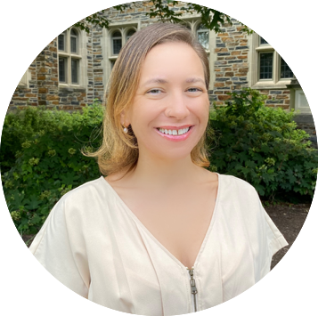

## Slides

```{=html}
<iframe class="slide-deck" src="/talks/5-discussion/discussion.html" height="420" width="747" style="border: 1px solid #2e3846;"></iframe>
```
[Source code for slides](https://github.com/mine-cetinkaya-rundel/quarto-world-of-possibilities-jsm24/tree/main/talks/5-discussion)

[Full screen slides](https://mine-cetinkaya-rundel.github.io/quarto-world-of-possibilities-jsm24/talks/5-discussion/discussion.html)

## Speaker

{style="float: right; padding-left: 10px;" fig-alt="Photo of Mine Çetinkaya-Rundel" width="200"}

[Mine Çetinkaya-Rundel](https://mine-cr.com/) is a Professor of the Practice and Associate Director of Undergraduate Studies in the Department of Statistical Science as well as the Director of First-Year Experience in Trinity College of Arts & Sciences at Duke University. She is also Senior Developer Advocate at Posit. Mine is a leading voice in modern statistics and data science education. Her work focuses on integrating reproducible computing, open-source tools, and real-world data into the statistics curriculum, transforming how students engage with data and statistical thinking. She is a co-author of [R for Data Science](https://r4ds.hadley.nz/), the creator and maintainer of [Data Science in a Box](https://datasciencebox.org/), and she teaches popular [data analysis](https://www.coursera.org/specializations/statistics) and [data science](https://www.coursera.org/learn/data-visualization-transformation-r) with R courses on Coursera.. She is also a core contributor to the OpenIntro project and an advocate for open educational resources and statistical computing in R. A Fellow of the American Statistical Association and an Elected Member of the International Statistical Institute, she has received numerous honors, including the ASA’s Waller Education Award and the Robert V. Hogg Award for Excellence in Teaching Introductory Statistics. She currently serves as Vice President of the International Association for Statistical Education (IASE) and as co-chair of the ASA's DataFest Steering Committee. Through her teaching, writing, and advocacy, Dr. ÇetinkayaRundel has advanced accessible, computation-rich, and reproducible data science education worldwide.
